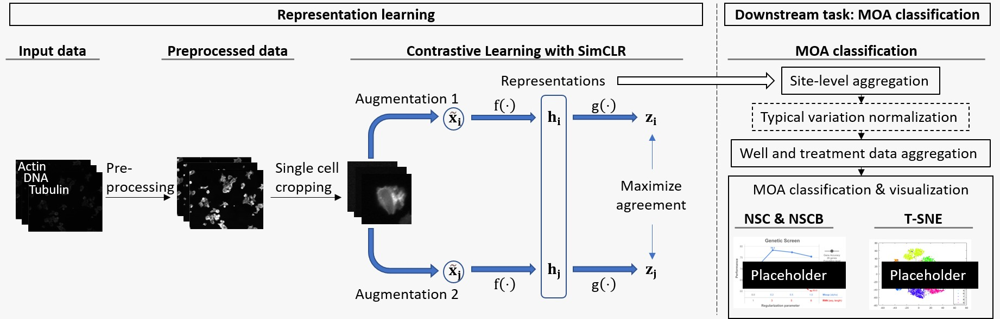

# SimCLR for cell-profiling
This repo hosts the code for all the experiments done as part of the group project "SimCLR for cell-profiling" in the course Deep Learning offered at ETH Zurich Autumn Semester 2020.

## Project overview



In this project we are attempting to improve single-cell representations by applying the SimCLR framework to multi-channel images of our “field-of-views”. A field-of-view is the underlying physical sample (composed of cells) of an image. The different channels represent fluorescence bound DNA, Tubulin and Actin. The original images are cropped to provide single-cell images by using cell locations as described in Ljosa et al. [2]. SimCLR is applied to single-cell images to extract appropriate single-cell representations. The representations of cells in a same field-of-view are aggregated by taking their mean morphological profile. The quality of mean profiles (i.e. mean representations) is evaluated based on NSC and NSCB metrics. Exploration and visualization of mean profiles is also part of our project.

## Datasets
The methods are evaluated on BBBC021 (Caie et al. [1]). This dataset consists of images captured from MCF-7 breast cancer cell populations exposed to a group of chemical compounds for a fixed amount of time. A subset of BBBC021 has previously been investigated and annotated for MOAs by Ljosa et al. [2]. Our project uses this particular subset that provides an MOA label as well as a set of single-cell locations for each field-of-view.

## Running experiments
The code is based on pytorch. All the experiments can be tuned using `config.yaml` and can be run by simply using `python run.py`.

### Installation
```
$ conda env create --name simclr --file env.yml
$ conda activate simclr
$ python run.py
```

### Repository Structure
- The `data_aug` module holds the code for reading the single cell image dataset, loading it as dataloaders and applying various augmentations.
- `loss` module holds the implementation of NTXent loss and LARS optimizer.
- The module `models` holds implementation of base networks (4 layer CNN) and resnet models.
- `feature_eval` holds the classfier code that can be used on top of the representations to test progress. Currently we are using a random forest classifier, but a simple linear head can also be used.
- Finally, `simclr.py` binds all these modules together and holds the code for overall training.
- The trained model checkpoints are stored in directory `{working_directory}\runs`.
- The code for downstream task (single cell representation aggregation and KNN training) is present in module `ADD`. It also contains tsne visualization code ran on the aggregated data.

### Config hyperparameters
The config file and various hyperparameters are explained details below.

```yaml
# A batch size of N, produces 2 * (N-1) negative samples. Original implementation uses a batch size of 8192
batch_size: 512

# Number of epochs to train
epochs: 400

# Frequency to evaluate the similarity score using the validation set
eval_every_n_epochs: 1

# Specify a folder containing a pre-trained model to fine-tune. If training from scratch, pass None.
fine_tune_from: 'resnet-18_80-epochs'

# Frequency to which tensorboard is updated
log_every_n_steps: 50

# l2 Weight decay magnitude, original implementation uses 10e-6
weight_decay: 10e-6

# if True, training is done using mixed precision. Apex needs to be installed in this case.
fp16_precision: False

# Frequency to evaluate classifier
eval_classifier_n_epoch: 50

# Frequency to store checkpoints
checkpoint_every_n_epochs: 50

# Model related parameters
model:
  # Output dimensionality of the embedding vector z. Original implementation uses 2048
  out_dim: 256

  # The ConvNet base model. Choose one of: "resnet18" or "resnet50" or "resnet101". Original implementation uses resnet50
  base_model: "resnet50"

# Dataset related parameters
dataset:
  # path for csv metadata file
  path: '../single-cell-sample-train/sc-metadata.csv'

  # path where cell images are stored
  root_dir: '../single-cell-sample-train/'

  # jitter parameter
  s: 1

  # dataset input shape. For datasets containing images of different size, this defines the final
  input_shape: (96,96,3)

  # Number of workers for the data loader
  num_workers: 0

  # Size of the validation set in percentage
  valid_size: 0.05

  # data sampler: weighted or random, weighted should be used if training with DMSO images
  sampler: "random"

  # whether to preload the images before training or on the fly
  preload: True

# dataset for training the classfier
# all the parameters within this field are same as the dataset field
eval_dataset:
  path: '../single-cell-sample-train/sc-metadata.csv'
  root_dir: '../single-cell-sample-train/'
  input_shape: (96,96,3)
  num_workers: 0
  valid_size: 0.3
  sampler: "random"
  preload: True

# NTXent loss related parameters
loss:
  # Temperature parameter for the contrastive objective
  temperature: 0.5

  # Distance metric for contrastive loss. If False, uses dot product. Original implementation uses cosine similarity.
  use_cosine_similarity: True
```

## External Code References
- We use the SimCLR pytorch code available at [SimCLR training in pytorch](https://github.com/sthalles/SimCLR) as starter code and build on top of it to run experiments specifically for our dataset. We also referred to this [repo](https://github.com/Spijkervet/SimCLR) for SimCLR training tricks, but eventually didn't use their code.
- For generating single cell images we use the code provided at [Deep Profiler](https://github.com/cytomining/DeepProfiler) from the baseline [2].
- We use the nsc and nscb evaluation code from [Deep profiler experiments](https://github.com/broadinstitute/DeepProfilerExperiments).

## References
[1] Caie, P.D. et al. (2010) High-Content Phenotypic Profiling of Drug Response Signatures across Distinct Cancer Cells. Molecular Cancer Therapeutics, 9, 1913–1926.

[2] Ljosa, V. et al. (2013) Comparison of Methods for Image-Based Profiling of Cellular Morphological Responses to Small- Molecule Treatment. J Biomol Screen. 18(10):1321–9. doi: 10.1177/1087057113503553.
